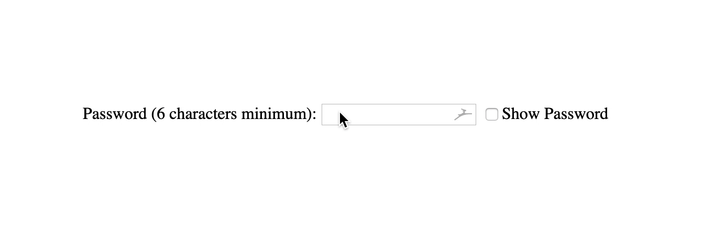

# Form Password Field

1. Create a form with a password input field

1. Create a checkbox and write a function that enables the user show/hide password.

1. The password should consist of minimum 6 characters.

1. **Optional:** Style the form.

> Hint: Refer to the representation below, for an idea of what your result should look like.

# toggle-password-js
# toggle-password-js
